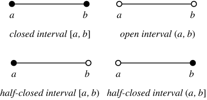
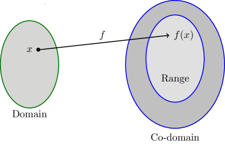

hero: 15 - Functions and Limits

# Functions and Limits
## Function or Mapping
* A function is a rule or correspondence, relating two sets in such a way that each element in the first set corresponds to one and only one element in the second set.
* A function $f$ from a set $X$ to $Y$ is a rule or a correspondence assign to each element $x$ in $X$ a unique element $Y$.
* A function can be denoted by:
    * $y=f(x)$
    * $f:X\to Y$
    * $f$ is a mapping from $X$ to $Y$

## Intervals

* Open interval means boundary is not included.
* Close interval means boundary is included.

## Domain, Co-domain & Range

In a function $f:X\to Y$:

* $X$ is called domain
* $Y$ us called Co-domain
* Only mapped elements of co-domain are called range.

## Graph of a function
If a vertical line intersects a graph in most one point, it is graph of a function.

## Piece-wise function
Such functions which are defined by two or more rules are called piece-wise defined functions.

## Types of Functions
Some important types of functions are discussed here.

### Algebraic Function
#### Polynomial Function
* The function of the form $$ P(x)=a_nx^n+ a_{n-1}x^{n-1} + a_{n-2}x^{n-2} + ... + a_2x^2 + ax + a_0$$ is called polynomial function of degree $n$.
* $a_n \rlap{/}{=}0$, and $n$ is any non negative integer.
* Domain and range is real number.

#### Linear Function
* If the degree of a polynomial function is $1$, then it is called linear function.
* The general form a linear function is $f(x)=$ $ax+b$, $a \rlap{/}{=}0$, $a$ & $b$ are real numbers.
* Domain and range of linear function is real numbers.
* The graph of a linear function is a straight line.

#### Identity Function
* For any set $X$, a function $I:X\to X$ of the form $I(x)=x$, $\forall x\in X$ is called identity function.
* Domain and range of $I$ is $X$.

#### Constant Function
* Let $X$ and $Y$ be sets of real numbers. A function $C:X\to Y$ defined by $C(x)=a$, $\forall x\in X$, $a\in Y$ is called a constant function.
* Domain is all real numbers.
* Range is $a$(any constant).

#### Rational Function
* A function of $R(x)$ of the form $\frac{P(x)}{Q(x)}$, where both $P(x)$ and $Q(x)$ are polynomial functions and $Q(x)\rlap{/}{=}0$, is called a rational function.
* The domain of a rational function is set of all real numbers for which $Q(x)\rlap{/}{=}0$.
* The range set of real numbers.

### Trigonometric functions
#### Sine Function
* $y=\sin(x)$
* Domain $R$
* Range $-1\le y\le 1$
#### Cosine Function
* $y=\cos(x)$
* Domain $R$
* Range $-1\le y\le 1$
#### Tangent Function
* $y=\tan(x)$
* Domain $\{x:x\in R\land x \rlap{/}{=}(2n+1)\pi/2\}$, $n\in Z$
* Range $R$
#### Cotangent Function
* $y=\cot(x)$
* Domain $\{x:x\in R\land x\rlap{/}{=}n\pi\}$, $n \in Z$
* Range $R$
#### Secant Function
* $y=\sec(x)$
* Domain $\{x:x\in R\land x \rlap{/}{=}(2n+1)\pi/2\}$, $n\in Z$
* Range $y\le1$, $y\le-1$
#### Cosecant Function
* $y=\csc(x)$
* Domain $\{x:x\in R\land x\rlap{/}{=}n\pi\}$ $n \in Z$
* Range $y\le1$, $y\le-1$

### Inverse Trigonometric Functions
#### Inverse Sine Functions
* $y=\sin^{-1}x \iff x=\sin y$
* Domain $-1\le x\le 1$
* Range $-\pi/2\le y\le\pi/2$
#### Inverse Cosine Functions
* $y=\cos^{-1}x \iff x=\cos y$
* Domain $-1\le x\le 1$
* Range $0\le y\le\pi$
#### Inverse Tangent Functions
* $y=\tan^{-1}x \iff x=\tan y$
* Domain $-\pi/2\le y\le \pi/2$
* Range $-\infty\le x\le\infty$

### Exponential Functions
* A function in which the variable appears as exponent, is called an exponential function.
* $y=e^x$, $y=e^{ax}$, $y=a^x$ are exponential functions.
* Domain $R$, Range $R$
* Range of $e^x$ is always non-negative real numbers.

### Logarithmic Functions
* A function involving $\log x$ or $\ln x$ are called logarithmic functions.
* Domain $R^+$
* Range $R$

### Hyperbolic Function
#### Hyperbolic Sine Function
$$ \sinh x=\frac{e^x-e^{-x}}{2} $$

* Domain $R$
* Range $R$

#### Hyperbolic Cosine Function
$$ \cosh x=\frac{ e^x + e^{-x}}{2} $$

* Domain $R$
* Range $[1, +\infty)$

#### Other Hyperbolic Functions
Remaining 4 hyperbolic functions are expressed in terms of $\sinh$ and $\cosh$ functions and have same properties that resemble tp those of trigonometric functions.

* Tangent Hyperbolic function $$ \tanh x=\frac{\sinh x}{\cosh x} =\frac{e^x - e^{-x} }{e^x + e^{-x}} $$
* Cotangent Hyperbolic function $$ \coth x=\frac{\cosh x}{\sinh x} =\frac{e^x + e^{-x} }{e^x - e^{-x}} $$
* Secant Hyperbolic function $$ \sec h x=\frac{1}{\cosh x} =\frac{2 }{e^x + e^{-x}} $$
* Cosecant Hyperbolic function $$ \csc h x=\frac{1}{\sinh x} =\frac{2 }{e^x - e^{-x}} $$

### Inverse Hyperbolic Functions
* Sine Inverse Hyperbolic $$ \sinh^{-1} x= \ln \left( x+\sqrt{x^2+1} \right),~\forall x $$
* Cosine Inverse Hyperbolic $$ \cosh^{-1} x= \ln \left( x+\sqrt{x^2-1} \right),~x\ge1 $$
* Tangent Inverse Hyperbolic $$ \tanh^{-1} x= \frac{1}{2}\ln \left( \frac{1+x}{1-x} \right),~|x|<1 $$
* Cotangent Inverse Hyperbolic $$ \coth^{-1} x= \frac{1}{2}\ln \left( \frac{x+1}{x-1} \right),~|x|<1 $$
* Secant Inverse Hyperbolic $$ \sec h^{-1} x= \ln \left( \frac{1}{x}+ \frac{\sqrt{1- x^2}}{x} \right),~0<x\le1 $$
* Cosecant Inverse Hyperbolic $$ \csc h^{-1} x= \ln \left( \frac{1}{x}+\frac{\sqrt{1+x^2}}{|x|} \right),~x{=}\llap{/}0 $$

## Some Other Functions

### Explicit Functions
If y is easily expressed in terms of independent variable $x$, then $y$ is called an explicit function.
#### Examples
* $y=\sqrt{2x+1}$
* $y=x^2+4x+1$

### Implicit Function
If $y$ cannot expressed in terms of independent variable $x$, then v is called an implicit function.
#### Examples
* $xy^2_2xy=0$

### Even & Odd Function
* A function $f(x)$ is said to be odd if $f(-x)=f(x)$.
* A function $f(x)$ is said to be odd if $f(-x)=-f(x)$

#### Properties
* Constant function is always even
* Even function is symmetric about y-axis
* Odd function is symmetric about origin
* The graph of odd functions occur in 1st and 3rd Quadrant or 2nd and 4th Quadrant
* Sum, difference and quotient if even function are even
* Sum, difference and quotient of odd function are odd
* Product of an even and odd function is odd

### Greatest Integer Function
The greatest integer function is denoted by $[x]$, pairs with each real number $x$ the greatest integer function is denoted by $[x]$, pairs with each real number $x$ the greatest integer not exceeding $x$.
#### Examples
* $[3,2]=3$
* $[-0.6543]=-1$

### Absolute Value Function
$$ |x|=\begin{dcases}
   x &\text{if } x\ge0  \\
   -x &\text{if } x<0
\end{dcases} $$
#### Examples
* $|3|=3$
* $|-4.12|=4.12$

### Parametric Function
Sometimes the relation between $x$ and $y$ can be expressed in terms of third variable, which is called parameter, such type of functions are Parametric functions.
#### Examples
$$ \begin{aligned} x &=a t^2 \\y &=at \end{aligned} \Bigg\} \text{ Parabola} $$

$$ \begin{aligned}x&= a\cos\theta \\y&= b \sin\theta\end{aligned} \Bigg\} \text{ Circle} $$

$$ \begin{aligned}x&=a\cos\theta \\y&=b\sin\theta\end{aligned} \Bigg\} \text{ Ellipse} $$

$$ \begin{aligned}x&=a\sec\theta \\y&=a\tan\theta\end{aligned} \Bigg\} \text{ Hyperbola} $$

## Some Important Identities
* $\cosh^2x-\sinh^2x=1$
* $\cosh^2x+\sinh^2x=\cosh 2x$
* $\sinh 2x=2\sinh x\cosh x$
* $\cosh x-1 = \csc h^2 x$
* $1-\tan \text{h} x=\sec \text{h} x$

## Composition of Functions

## Limits

### Some Fundamental Theorems on limits

* if $f(x)\le g(g)$ for all $x$ then $\lim_{x\to a} f(x)\le \lim_{x\to a} g(x)$.
* $\lim_{x\to a} f(x)=\ln \lim_{x\to a} f(x)$
* $\lim_{x\to a}\left[f(x)^n\right]=\left[\lim_{x\to z} f(x)\right]^n$, where $n$ is an integer.
* Sandwich Theorem (Aqueeze Principle): Let $f$, $g$ & $h$ be function such that $f(x)\le g(x)\le h(x)$ for all values of $x$. if $\lim_{x\to a}f(x)=L$ and $\lim_{x\to a}g(x)=L$ then $\lim_{x\to a}h(x)=L$

### Limit of a function at infinity
* The limit of a function at infinity means the limit as $x\to +\infty$ (x increasing beyond all bounds). If the limit is $K$  we write as follows: $$ \lim_{x\to +\infty}f(x)=K $$
* If $x\to -\infty$ ($x$ decreases beyond all bounds) and the limit of functions is $L$. We can write as: $$ \lim_{x\to -\infty} f(x)=L $$

#### Indeterminate Forms
An indeterminate form is an expression of the type:

|  |  |  |
|--|--|--|
| $\infty-\infty$ | $\frac{0}{0}$ | $\frac{\infty}{\infty}$ |
| $(\infty)^0$ | $(0)^{\infty}$ | $(0)^0$ |
| $(1)^\infty$ | $0\times\infty$ | $\infty\times\infty$ |

### One sided Limits
#### The left hand limit
$\lim_{x\to a} f(x)=L$ is read as limit of $f(x)$ is equal to $L$, as $x$ approaches $a$ from left i.e for all $x$ sufficient for all $x$ sufficiently close to $a$, but less than $a$.

#### The right hand limit
$\lim_{x\to a} f(x)=M$ is read as limit of $f(x)$ is equal to $M$, as $x$ approaches $a$ from left i.e for all $x$ sufficient for all $x$ sufficiently close to $a$, but greater than $a$.

#### Existence of Limit of a Function
The limit of a function exists if right hand limit = left hand limit
