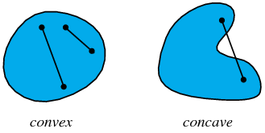

hero: 19 - Linear Inequalities & Linear Programming

# Linear Inequalities & Linear Programming

## Inequalities
Inequalities are of four types:

| Inequalities | Symbol |
|--------------|--------|
| Greater than | $>$    |
| Less than    | $<$    |
| Greater than or equal to | $\ge$ |
| Less than or equal to    | $\le$ |

## Linear Inequalities
Generally a linear inequality in two variables $x$ & $y$ can be one of the following four forms:

* $ax + by < c$
* $ax+ by \le c$
* $ax + by > c$
* $ax + by \ge c$

where $a$, $b$ & $c$ are constants also $a$, $b$ can not zero simultaneously.

## Some Important Results Related To Linear Inequality In Two Variables:
* $ax + by = c$ is called **associated** or **corresponding equation** of any of the above four linear inequalities.
* Every inequality divides a plane into two half planes.
* A vertical line divides the plane into left and right half planes.
* A non-vertical line divides the plane in to upper and lower half planes.
* If an inequality involves symbols $>$ or $<$ the half plane is open.
* If an equality involves symbols $\ge$ or $\le$ half plane is closed.
* A point of a solution region where two of its boundary lines intersect is called **corner point** or **vertex**.

## Procedure for Graphing a Linear Inequality in Two Variables
* Graph the corresponding equation $ax + by = c$ used a dashed line when symbols $>$ or $<$ involves, and a solid line when the symbols $\ge$ or $\le$ involves.
* The solution set is the half plane on one side of the boundary line. To determine which side, choose a test point (any point in the plane but not on the line) and check to see if the coordinates of the point satisfy the given inequality.

## Linear Programming
Linear programming is a branch of mathematics that deals with an important class of constrained optimization problems.

### Some terms related to linear programming;
* **Problem constraints:** The system of linear inequalities involved in the problem concerned is called problem constraints.
* **Decision variables:** Non-negative constraints are called decision variables.
* **Feasible region:** A restricted region under certain constraints is called the feasible region.
* **Feasible solution:** Each point of the feasible region is called feasible solution.
* **Feasible solution set:** The set of all feasible solutions of a system of linear inequalities is called feasible solution set.
* **Convex region** If the line joining any two points of a region lies entirely with in the region. then the region is called convex.

* **Objective function** A function which is to be maximized or minimized but not both is called objective function.
* **Optimal solution** The feasible solution which maximizes or minimizes the objective function is called optimal solution.

## Procedure for Determining Optimal Solution:
* Graph the solution set of linear inequality constraints to determine the feasible region.
* Find the corner points of the region.

* Evaluate the objective function at each corner point to find the optimal solution.

!!! info "To be Remembered"
    * There are infinite many feasible solutions in the feasible region.  
    * The intersection point of two boundary lines is a corner point only if it is feasible.
    * If a linear program has an optimal solution, it must occur at a corner point of the feasibility region.
