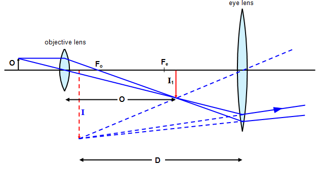

hero: 10 - Optical Instruments

# Optical Instruments
## Lens
* Lens is a piece of transparent medium bounded by two surfaces at least one of which is curved.
* Every lens is a part of some sphere.

## Types of Lenses
* **Convex lens:** It is thicker at the middle and thinner at the edges.
* **Concave lens:** It is thinner at the middle and thicker at the edges.

## Important Definitions
* **Centre of curvatures:** Centre of sphere from which spherical surface of lens is obtained. Every lens has two centers of curvatures.
* **Radius of curvature:** Radius of sphere from which spherical surface of lens is obtained. Every lens has two radii of curvature that may not be equal.
* **Principal axis:** The line joining its two centers of curvature.
* **Principal focus:**
    * For convex lens, principle focus is a point of convergence of refracted light ray. It is a real point.
    * For concave lens, principal focus is a point of divergence of refracted light rays. It is imaginary point.

    Every lens has two foci one on each side.

* **Optical Center:** A point inside the body of lens through which light rays pass undeviated.
* **Focal Length:** A distance between principal focus and optical center It is positive for convex lens and negative for concave lens.

!!! note
    It is not necessary that two focal lengths are equal for a lens.

* **Aperture:** The size of diameter of lens.
* **Power of lens:** Its ability to deviate light ray from its original path. $$ P = \frac{1}{f} $$ where $I$ is focal length in meter.
    * SI unit of power of lens is diopter. $P = 1D$ if $f = 1m$

## Combination of Lenses
* General rule for combination of 'n' lenses is $$ P=P_1+P_2+....+P_n $$
* For two double convex lenses $$ P=P_1+P_2=\frac{1}{f_1}+\frac{1}{f_2} $$ $$ \implies f=\frac{f_1f_2}{f_1+f_2} $$
* For two concave lenses $$ P=P_1+P_2=-\frac{1}{f_1}-\frac{1}{f_2} $$ $$ \implies f=\frac{-f_1f_2}{f_1+f_2} $$
* For one concave & other convex lenses $$ P=P_1+P_2=\frac{1}{f_1}-\frac{1}{f_2} $$ $$ \implies f=\frac{f_1f_2}{f_1-f_2} $$

## Lens Formula
* General lens formula is: $$ \frac{1}{p}+\frac{1}{q}=\frac{1}{f} $$
* Sign conversions:
    * $p$ is **+ve** for **real objects** and **-ve** for **virtual objects**
    * $q$ is **+ve** for **real image** and **-ve** for **virtual image**
    * $f$ is **+ve** for **convex lens** and **-ve** for **concave lens**

!!! info
    Positive sign is used where rays actually intersect. If not then we can use negative sign.
## Image Formation by Lens
### Convex Lens
| Position of Object | Position of Image | Nature of Image |
|--------------------|-------------------|-----------------|
| Beyond $2F$ | Between $F$ and $2F$ | Real, Inverted, Small |
| At $2F$ | At $2F$ | Real, Inverted, Equal |
| Between $F$ & $2F$ | Beyond $2F$ | Real, Inverted, Enlarged |
| At $F$ | At infinity | No Image Formed |
| Inside $F$ | On same side beyond object | Virtual, Erect, Enlarged |

## Magnification of Lens
* Linear magnification is: $$ M=\frac{p}{q}=\frac{h_i}{h_o} $$
* Angular magnification is: $$ M=\frac{q_i}{q_o}=\frac{\text{Angle formed at aided eye}}{\text{Angle former at naked eye}} $$
* For real image $$ M=\frac{q}{p} $$
* For virtual image $$ M=-\frac{q}{p} $$

!!! info
    For very small angles we can equate linear and angular magnifications.

### Visual Angle
* Visual angle is angle made by object at observer's eye.
* Apparent size of object varies with visual angle. $$ \text{Apparent size}\propto \text{Visual angle} $$

## Resolving Power
The resolving power of an instrument is its ability to reveal the minor details of the object under examination.

## Angle of Resolution
* The minimum angle that allows two point sources to appear distinctly separated is called angle of resolution. It is expressed as $\alpha_{\text{min}}$ $$ \alpha_{\text{min}}= 1.22\frac{\lambda}{D} $$
* Raleigh showed that resolving power of a lens of aperture $D$, under a light source of wavelength $\lambda$ is $$ R = \frac{D}{1.22\lambda} $$

## Lens Aberration
### Optical Aberration
It is the formation of blurred image due to size of lens because outer rays undergo more refraction than the inner ones.
### chromatic Aberration
It is the inability of a lens to bring all light rays (all colors) at single focus. Multicolored blurred image is formed.

### Remedies
* Provide such constraints on the lens that allows only parallel rays to enter the lens.
* Use the combination of convex and concave lenses called as achromatic lenses.

## Least Distance of distinct Vision
It is the minimum distance at which a normal eye can see an object clearly. $d =25cm$

!!! info
    As we get over the years upto old age the value of least distance of distinct vision is drastically affected.

## Optical Instruments
Optical instruments are those, which use light for their operations.

* Simple microscope
* Compound microscope
* Telescope
* Camera
* Michelson interferometer
* Spectrometer
* Periscope

## Simple Microscope
* Simple microscope (magnifier) is a double convex lens of short focal length
* Its magnifying power is $$ M=1+\frac{d}{f} $$
* It forms virtual, erect and magnified image at $d$. $$ M\propto \frac{1}{f} $$

## Compound Microscope
* Compound microscope consists of two convex lenses.
    * **Objective lens** of small size and short focal length.
    * **Eyepiece lens** of large size and large focal length.

