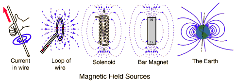
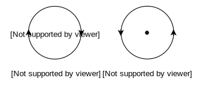
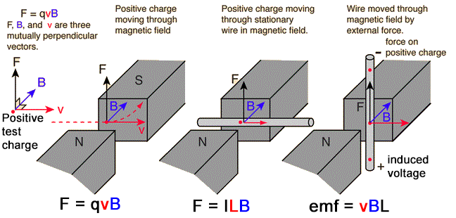
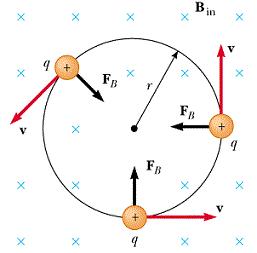
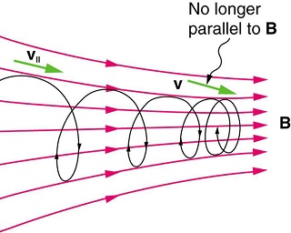
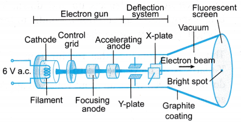

hero: 14 - Electromagnetism

# Electromagnetism
* Study of magnetic properties is called magnetism.
* Study of magnetic properties associated with Electricity and laws relating them is called Electromagnetism.
* Iron ore "Magnetite ($Fe_3O_4$)" was discovered as **early as 600 BC** from Magnesia, a region in Asia Minor, situated in modern Turkey.
* Ore magnet was named "Lodestone" meaning leading stone, having directional property.
* Magnetic field arises due to moving electric charges like in atoms or in conducting materials.

## Characteristics of a Magnet
* It has two poles.
* North Pole of magnet coincide with south pole of earth's magnet and vice versa.
* Magnetism at poles is greater than at middle.
* Like poles attract while unlike poles repel each other.
* Freely suspended magnet sets itself along N-S direction.

!!! info
    Poles of magnet can't be separated i.e If large magnet is cut into two parts each part will be a complete magnet in itself having both N and S poles.

* An un-magnetized magnetic material can be magnetized as follows:
    * By electric method (passing strong DC)
    * By single touch or double touch methods.
* Magnet can be demagnetized as follow:
    * By passing AC
    * BY heating strongly
    * By striking a magnet again and again with surface like that of earth e.g by hammering with hammer.

## Magnetic Field
Magnetic field is a region around a magnet within which it can exert its influence upon a magnetic material.

Magnetic field consists of lines of magnetic force having following properties:



* Two magnetic lines of force can't intersect each other.
* Magnetic lines of force fill whole space around a magnet.
* Magnetic lines of force emerge from N and end on S.
* The no of magnetic lines at a point gives strength of magnetic field.
* Longitudinally they tend to shorten their length. It explains attraction between opposite poles.
* Transversely they repel each other. It explains the repulsion between two like poles.
* Direction of magnetic field of the current is found by right hand rule for positive charges or conventional current

### Magnetic Field Due to Current in Straight Wire
Hans Oersted found that a magnetic field is set up in the region surrounding current carrying wire.

* The lines of force are circular and their direction depends upon the direction of current.
* The magnetic field lasts only as long as the current is flowing through the wire.

### Right Hand rule
If the wire is grasped in fist of right hand with the thumb pointing in the direction of the conventional current, the fingers of the hand will circle the wire in the direction of the magnetic field.

* Following figures should be kept in mind about direction of magnetic field.



## Magnetic Field & Magnetic force
Origin of magnetism is motion of charges, was found by Oersted.

### Force on a Moving Charge in a Magnetic Field
In an experiment with bar magnet and field produced by charges flowing in a wire (current), following results are drawn:

* If $v||B$, then $F=0$.
* If $v\bot B$, then $F=\text{max}$.
* $F\bot v$ and $F\bot B$ means $F$ is normal to the plane containing $v$ and $B$.
* $\overline{F}=q(\overline{v}\times\overline{B})$
* Magnetic field can be given as $$ B=\frac{F}{qv\sin\theta} $$

!!! Quote "Magnetic Field Strength"
    Magnetic force acting on a unit charge entering perpendicularly through a magnetic field with speed of $1m/s$ is called **magnetic field strength**.

* If $F=1$, $q=1C$, $V=1m/s$, then $B=1\text{Tesla}$ $$ 1T = \text{tesla}=\frac{Ns}{Cm}=\text{impulse per coulomb per meter. If }\theta=90^o $$

!!! Quote "Tesla"
    If $1N$ force acts on a charges particle carrying $1C$ charge and entering a magnetic field at a speed of $1m/s$ perpendicularly, then the magnetic field is said to be $1T$.

### Force on a Current Carrying conductor in a Uniform Magnetic Field
* Current carrying conductor experiences a force when placed in a **Uniform Magnetic Field** that is given by $$ \overline{F}=I(\overline{L}\times\overline{B}) $$ Where $L$ is length of conductor inside the magnetic field and defined along the direction of conventional current.
* Drift speed of an electron in a conductor is given as: $$ v_d = \frac{1}{nAe} $$
* Magnetic field can be given as: $$ B=\frac{F}{IL\sin\theta} $$

!!! Quote "Magnetic field"
    Magnetic force acting on a conductor of $1m$ carrying $1A$ current and placed $\bot$ to magnetic field.

* If $F=1N$, $I=1A$, $L=1m$ & $\theta=90^o$ then $B=1\text{ Tesla}$ $$ 1T = \frac{N}{Am} $$
* Gauss is a small unit of $B$. $IT=10^{4}G$

## Current Carrying Coil Placed in a Uniform Magnetic Field
Current carrying coil placed in a uniform magnetic field experiences a torque given by:
$$ \tau=BINA \cos \alpha \;\;\;\text{or}\;\;\; BINA\sin\theta $$
Where $N=$No of turns in coil

$A=$ Face area of coil

$\alpha=$ Angle between plane of coil and $B$

$\theta=$ Angle between outward normal to the plane of coil and magnetic field.

!!! note
    Net force on coil is zero but net torque is not zero.

## Magnetic Flux & Magnetic Flus Density

!!! Quote "Magnetic Flux"
    Dot product of magnetic field and vector area of flat surface.
    $$ \phi_B =\overline{A}\cdotp\overline{B}=AB\cos\theta $$
    $$ B=\frac{\phi_B}{A\cos\theta} $$
    where B is magnetic flux density or flux per unit area normal to magnetic field lines.

* Unit of magnetic flux is weber ($Wb$).

$\phi_B=1Wb$

if $B=1T$, $A=1m^2$, $\theta=0\degree$,

then $1Wb=1T.1m^2$

$1Wb=1NmA^{-1}\qquad$ $(\because T=NA^{-1}m^{-1})$

* Ampere's law is used to find magnetic field strength.

!!! info
    

## Ampere's Law

!!! Quote "Ampere's Law"
    The sum of quantities $\overline{B}\cdotp\overline{\Delta L}$ for all path elements into which the complete loop has been divided equals $\mu_{\omicron}$ times the current enclosed by the loop. $$ \displaystyle\sum^n_{r=1}( \overline{B}\cdotp\overline{\Delta L})\_{r} = \mu_{\omicron}I $$
    where $I$ is the current enclosed by closed path & $\mu_{\omicron}=4\pi\times10^{-7}Wb/Am$

### Applications
* Field due to solenoid $B=\mu_{\omicron}nI$
* Where $n=$ No of turns per unit length $= \frac{N}{L}$
* Field due to toroid $$ B=\mu_{\omicron}nI $$ where $n=\frac{N}{2\pi r}$ and $\mu=4\pi\times10^{-7}Wb/Am$

### Magnetic Force Between Two Infinitely Long Parallel Current Carrying Wires
Lets us consider two infinitely long parallel straight current carrying conductors placed at distance from each other. Let $I_1$ and $I_2$ be the current flowing in them. Then the force acting per unit length of any wire is given by:


$$ F=\frac{\mu_{\omicron}}{4\pi}\frac{2I_1I_2}{r}=2\times10^{-7} \frac{I_1I_2}{r} N $$

For $l$ meter length of any wire the force is given by:

$$ F=\frac{\mu_o}{4\pi}\frac{2I_1I_2}{r}\times l = 2\times 10^{-7} \frac{I_1I_2}{r} \times l\; \text{Newton} $$

If the currents are flowing in the direction force of attraction exists between the wires and if the current flows in the opposite direction, force of repulsion exists between the wires.

!!! Question
    Is it possible that we keep increasing the number of turns of coil but the magnetic field strength remains constant? Yes. Why?

## Solenoid & Toroid
* Solenoid is a cylindrical coil wound on a magnetic or non-magnetic material called core.
* When current flows through a solenoid, the magnetic field is produced inside as well as outside it.
* Field of solenoid behaves as a bar magnet.
* Toroid is a solenoid bent into the form of a circle.
* Field of toroid is in the form of circular lines of force.

## Force on Charge Particle in an Electric & Magnetic Field
As, $F_e=qE$ and $F_m=q(v\times B)$

So, $F= F_e+F_m$
$$ F=qE+q(v\times B) $$


where F is called **Lorentz Force**.

* Electric force does work.
* Magnetic force does no work.


## Motion of a Charged Particles in a Magnetic Field

* When a narrow beam of electron moving with constant speed $v$ be projected at right angles to a known uniform magnetic field $B$ directed into plane of paper, the electrons experiences force at right angle to their direction and they will start moving in a circular path.

$F_c=F_m$

$\frac{mv^2}{r}=qvB$

$mv=qBr$

$r=\frac{mv}{qB}=\frac{p}{qB}$ where $p$ is the momentum of particle.



* Magnetic force can do no work on the charged particle entering magnetic field because $F_m \bot v$(always).
* Time period of charges particle subjected to circular motion in a magnetic field is given as: $T=\text{circumference}/\text{velocity}$

$\;\;=2\pi R/v$$\qquad$$=2\pi mv/qBv$

$\;\;=2\pi m/qB$
* frequency pf charged particle circulating in a magnetic field is given as: $$ f=qB/2\pi m $$ It is known as **cyclotron frequency**.
* If a particle has both components of velocity $v_{\bot}$ and $v_{||}$ and is allowed to enter magnetic field, it adopts helical motion.



* Force at $90\degree$ to the velocity, changes direction and not the speed of the particle.

## e/m Ratio
* e/m of a charged particle can be given as $$ \frac{e}{m}=\frac{v}{Br} $$ where $r$ is determined by Thomson's apparatus while velocity is determined by following two methods.

**Potential difference method**
$$ v=\sqrt{2V\frac{e}{m}} $$
Thus
$$ \frac{e}{m}=\frac{2V}{B^2 r^2} $$

Where $V$ is P.D, $B$ is magnetic field & $r$ is radius.

**Velocity selector method**
$$ v=\frac{E}{B} $$
Thus
$$ \frac{e}{m}=\frac{E}{B^2r} $$

The value of $e/m$ is equal to $1.758\times10^{11}C/kg$

!!! Question
    The $e/m$ of a proton is greater or less than an electron?

## Cathode Ray Oscilloscope (CRO)
* IT is a high-speed graph-plotting device same as **picture tube of TV** set or monitor of a computer.
* Electron beam is produced and deflected by voltage.
* Fluorescent screen make it visible.
* A grid is used to control the number of electrons.
* The grid is at a negative potential with respect to cathode.
* Electrons are accelerated by anode.
* CRO is used for displaying the waveform of given voltage.
* Once the waveform is displayed, we can measure the voltage, its frequency and phase.



## Torque
* A current carrying coil placed in magnetic field, will be rotated, in magnetic field producing torque. $$ \tau=BINA \cos\alpha $$ where $\alpha$ is the ngle made by the plane with magnetic field. $N$ is the number of turns of coil. $A$ is the area of the coil.

```
   image missing
```

## Electrical Measuring Instruments
Electrical measuring instruments are those devices, which convert electrical energy to mechanical energy.


!!! info
    All the electrical measuring instruments can only read current because current is the characteristic that can be measured as it can show physical effects. So all measuring instruments show different scaled only but they are measuring current e.g a voltmeter can measure voltage but actually it measures current and display it on the scale of volts.

### Examples
* Galvanometer
* Voltmeter
* Ammeter
* AVO meter


## Galvanometer (GM)
Galvanometer is used for the direction of both AC and DC & voltages.

* Galvanometer is a parent instrument, which can be converted into voltmeters and ammeters etc.

### Principle
Current carrying coil experiences electric torque $\tau=BINA\cos\alpha$, when placed in magnetic field.

### Types
* Moving coil Galvanometer
* Moving magnet Galvanometer

### Major parts of moving coil GM
* pole piece made concave.
* suspension wire
* lamp scale arrangement
* coil
* hair spring

### Working moving coil GM
* When coil of GM stops after deflection, then $$ \text{Deflecting torque} = \text{Restoring torque} $$ $$ BINA\cos\alpha=c\theta $$ Here $\alpha=0$, $$ I=\frac{c\theta}{BAN} = k\theta $$ where $c$ represents couple per unit twist or torsion constant that depends upon the nature and geometry of suspension wire.
* Galvanometer constant is given as: $$ K=\frac{c}{BAN} $$
* According to above equation, the Galvanometer can be made sensitive by:
    * Increasing the length and decreasing the diameter of suspension wire.
    * $B,A,N$ are made large. Best is to make $B$ as strong as possible.

!!! info
    The needle of the galvanometer should stop quickly at the mean position, thus should suffer lesser oscillations. So the galvanometers are designed such that these oscillations can be minimized. So they are critically damped. Such type of galvanometer is called **dead head galvanometer**.

### Modifications is Weston-type Galvanometer
* Suspension wire is replaced by shaft with pivot.
* Lamp-scale arrangement is replaced by light aluminum needle and graduated scale.

## Ammeter
Galvanometer is used to measure current when converted into ammeter.

* Galvanometer can be converted into AM by connecting a shunt (low resistance) in parallel to its coil. Value of shunt is given as: $$ R=\fraC{I_g R_g}{I-I_g} $$ where $I$ is called range.

* To increase the range of Ammeter, shunt resistance should be made more small.
* Range of Ammeter is given by: $$ =I_g\left[\frac{I+R_g}{R_s}\right] $$

* Ammeter is always connected in series.
* An Ammeter must have very low resistance so that it does not disturb the circuit resistance.

## Voltmeter
* Voltmeter is high resistance Galvanometer
* To convert Galvanometer into Voltmeter, a high resistance $R_h$ is connected in series with its coil.
* High resistance, which converts Galvanometer into Voltmeter is given by $$ R_h=\frac{V}{I_g}-R_g $$ where $V$ is called **range of voltmeter**.
* Range of voltmeter is given by $$ V= I_g(R_g+R_h) $$ It shows that $V\propto R_h$ so making resistance $R_h$ higher can make a Voltmeter more sensitive
* Voltmeter is always connected in parallel.
* Reading of Voltmeter is not accurate as it draws some current for its working. Hence it measures less voltage than actual.
* For accurate measurement of voltage, potentiometer is used.

## Ohm Meter
* Rapidly measures resistances.
* Adjustable resistance along with cell is used internally in ohmmeter. Adjustable resistance is called **limiting resistance**

## AVO meter
It is used for measurement of current, voltage & resistance.

* A for Amp
* V for voltage
* O for Ohm

No of scales on AVO meter are three:

* Ohm Scale
* Current Scale both for AC & DC
* Voltage Scale both for AC & DC

### As Ohmmeter
Circuit is given below:

### As Voltmeter
* Set of resistances connected in series to coil of Galvanometer is called **multiplier**
Circuit is given below:

### As Ammeter
* Set of shunts connected in parallel is called **Universal Shunt** or **Aryton**


## Digital Multimeter (DMM)
It is AVO meter but have **digital display**.

* It is gives decimal counting, polarity and unit for $V, A$ or $\omega$
* It is free from human errors of **polarity selection**.
